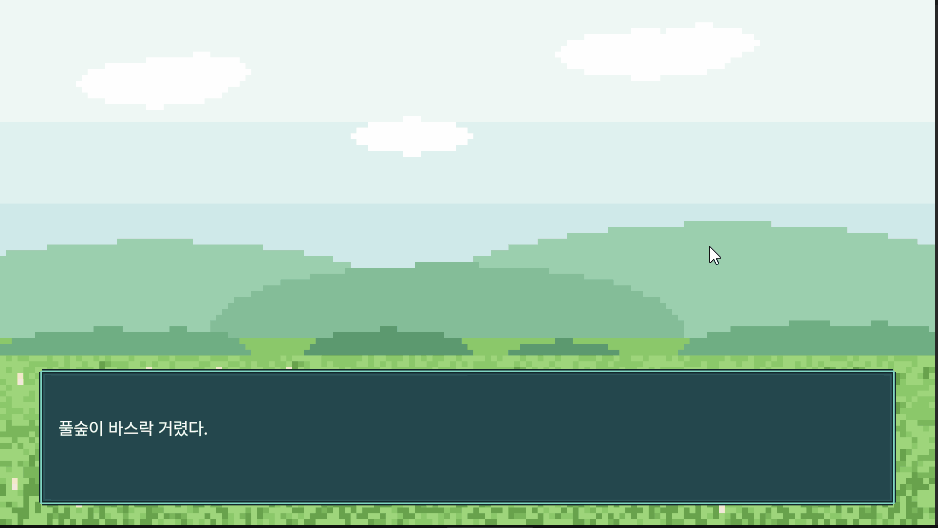
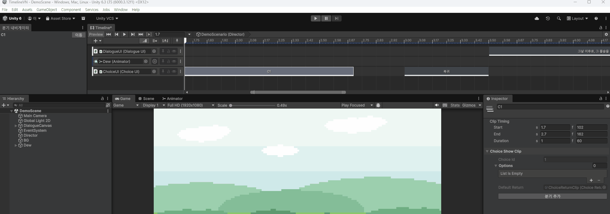

# TimelineVN

Unity Timeline 을 확장해서, Timeline 창 하나로 비주얼 노벨 한 장면을
만들 수 있게 하는 커스텀 트랙 시스템입니다.



- 시간이 흐르는 Timeline 을, 클릭으로 진행하는 비주얼 노벨 방식으로 확장했습니다
- 선택지와 분기를 시간축 위에서 표현합니다

---

## 왜 Timeline 으로 만들었나

시작은 단순한 짐작에서 나왔습니다.

Timeline 을 실무에서 거의 써본 적은 없었고, VN 툴 쪽도 마찬가지였습니다.
Timeline 은 시간에 맞춰 알아서 진행되는 물건으로 보였고, VN 도 대사가 순서대로
흘러가니 비슷하지 않을까 생각했습니다.

실제로는 진행 단위가 달랐습니다. Timeline 은 시간이 흐르는 대로 쭉 나아가고,
VN 은 클릭이나 터치로 한 칸씩 나아갑니다. 대사에서 기다려야 하는데 시간은 계속
흐르니까요. 이 충돌을 푸는 것이 결국 이 프로젝트의 중심 작업이 됐습니다.

막힌 김에 기존 도구들도 찾아봤습니다. Ren'Py 나 Naninovel 같은 주류 도구는
전부 텍스트 스크립트 기반이었습니다. 대사가 많아질수록 그쪽이 유리합니다.
검색이 되고, 버전 관리가 되고, 번역을 붙이기도 좋습니다.

그래도 Timeline 쪽에 장점도 있다고 봤습니다.

- 한 시간축 위에 여러 트랙이 쌓이므로, 표정과 대사와 카메라가 언제 겹치는지가
  그림으로 보입니다
- 만드는 방식이 코드 작성이 아니라 클립을 끌어다 놓고 인스펙터를 채우는 쪽입니다
- 별도의 VN 제작 환경을 들이지 않습니다. Unity 가 이미 갖고 있는 Timeline 위에
  트랙 하나를 얹는 것이라, Animation Track 이나 Audio Track 이 그대로 옆에 붙습니다.
  게임 안에 들어가는 VN 스타일 콘텐츠를 작업하기 좋습니다

그래서 이 프로젝트는 전용 VN 도구를 대체하려는 것이 아닙니다.
게임 전체가 VN 인 경우보다, 일반적인 Unity 게임의 대화 장면이나
스토리 이벤트 쪽에 맞습니다.

---

## 지금 되는 것

대사

- Timeline 창에서 대사 트랙 추가, 클립 하나가 대사 하나
- 재생하면 클립 순서대로 대사창에 뜹니다
- 클립이 끝나면 멈추고, 스페이스나 클릭이나 터치로 다음 대사로 갑니다
- 연출 도중에 입력하면 기다리지 않고 그 대사의 정지 지점으로 건너뜁니다
- 클립마다 정지 여부를 끌 수 있습니다
- 대사가 한 글자씩 찍힙니다. 재생 헤드를 끌면 그 시점 글자 수가 그대로 보입니다
- 자동진행, 2배속 기능을 사용할 수 있는 버튼

스프라이트 트랙

- 스프라이트 트랙으로 표정을 바꿉니다. 이미지를 트랙에 끌어다 놓으면 클립이 되고,
  여러 장을 한꺼번에 끌면 순서대로 놓입니다

선택지와 분기

- 선택지를 화면에 띄우고, 고르면 그 분기로 이어집니다
- 분기가 끝나면 원래 자리로 돌아오거나, 거기서 장면을 끝냅니다
- 분기를 만들 때 클립 생성과 연결이 자동으로 됩니다
- 연결이 빠지면 Timeline 창의 그 클립에 경고가 뜹니다

편집 화면

- 클립에 대사 내용이 보입니다. 마우스를 올리면 전문이 뜹니다
- 분기마다 다른 색으로 칠해집니다
- 분기 목록을 띄우고 골라서 그 구간으로 이동하는 창이 있습니다
- 재생 헤드를 끌면 그 시점 화면이 그대로 보입니다

---

## 쓰는 법

1. 씬에 `PlayableDirector` 를 만들고 `VisualNovelDirector` 를 같이 붙입니다
2. Timeline 창 우클릭 -> Dialogue Track
3. 트랙에 대사창(`DialogueUI`) 을 바인딩합니다
4. 클립을 올리고 인스펙터에 화자 이름과 대사를 적습니다
5. 재생합니다

분기를 넣으려면 Choice Track 을 추가하고 선택지 클립을 올린 뒤,
인스펙터의 "분기 추가" 를 누릅니다.

`Assets/Scenes/DemoScene` 에 동작하는 예제가 있습니다.

---

## 만드는 방식

코드를 쓰지 않고 Timeline 창에서 만듭니다.

```
DemoScenario (Timeline)
├─ Dialogue Track      -> DialogueUI 바인딩
│    [대사1][대사2][선택지]  ...  [분기 시작][대사][분기 끝]
├─ Choice Track        -> ChoiceUI 바인딩
└─ Animation Track     -> 캐릭터 Animator 바인딩
```

대사 하나가 클립 하나입니다. 여기서 대사 하나는 대사창을 한 번 채우는 분량이고,
클릭 한 번에 넘어가는 단위입니다. 안에 줄바꿈이 몇 개 있든 상관없습니다.

클립을 끌어서 위치와 길이를 바꾸고, 클립을 선택해 인스펙터에 화자 이름과 대사를 적습니다.

클립 길이는 대사를 읽는 시간이 아닙니다. 그 대사가 떠 있는 동안 다른 트랙이
연출을 소화하는 시간이고, 클립 끝에서 멈춥니다. 읽는 속도는 플레이어 몫이라
멈춘 채로 무한정 기다립니다.

클립 사이를 붙이면 누르는 즉시 다음 대사로 가고, 벌리면 그만큼 뜸을 들입니다.
빈 대사 클립을 놓으면 그 구간은 대사창이 빕니다.
전부 Timeline 창에서 눈으로 보입니다.

### 분기 만들기

분기는 같은 타임라인 안에서 시간을 옮기는 방식입니다.
각 분기를 시간축 뒤쪽에 두고, 선택지를 고르면 그 자리로 건너뜁니다.

문제는 클립들이 서로를 참조한다는 것입니다. 선택지 항목이 분기 시작을 가리키고,
분기 시작이 분기 끝을 가리키고, 분기 끝이 돌아올 자리를 가리킵니다.
이걸 손으로 이으면 반드시 빠뜨립니다.

그래서 버튼 하나로 끝나게 했습니다.



클립 생성, 배치, 참조 연결, 색 지정까지 한 번에 됩니다.
그래도 연결이 빠지면 Timeline 창의 그 클립에 경고가 뜹니다.

---

## 구조

```
Assets/Scripts/
├─ Dialogue/           대사
│   DialogueLine          대사 하나의 데이터
│   DialogueUI            화면에 그린다
│   DialogueTrack         Timeline 트랙
│   DialogueClip          클립. 대사를 들고 있다
│   DialogueClipBehaviour 클립의 실행부. Apply 를 제공한다
│   DialogueTrackMixer    활성 클립을 골라 Apply 를 부른다
│   Editor/               클립 이름 표시, 트랙 생성 시 처리
├─ Choice/             선택지와 분기
│   ChoiceShowClip        선택지를 띄우는 클립
│   ChoiceShowClipBehaviour  그 클립의 실행부
│   ChoiceEntryClip       분기 시작. 점프 도착지
│   ChoiceExitClip        분기 끝. 점프 출발지
│   ChoiceReturnClip      돌아와 착지하는 자리
│   ChoiceOption          선택지 하나. 문구와 분기 참조
│   ChoiceTrack           Timeline 트랙
│   ChoiceTrackMixer      활성 선택지를 골라 띄운다
│   ChoiceUI              선택지 화면. 결과를 들고 있는다
│   ChoiceSlot            선택지 버튼 하나
│   Editor/               자동 생성과 배선, 색칠, 경고, 내비게이터 창
├─ SpriteSwap/         스프라이트 교체
│   SpriteTrack           Timeline 트랙. SpriteRenderer 를 바인딩한다
│   SpriteClip            클립. 스프라이트 하나를 들고 있다
│   SpriteClipBehaviour   클립의 실행부. Apply 를 제공한다
│   SpriteTrackMixer      활성 클립을 골라 Apply 를 부른다
│   Editor/               클립 이름 표시, 미설정 경고
├─ Timeline/           트랙 공통
│   ISingleClip           한 시점에 하나만 활성인 클립 인터페이스
│   IStopPointClip        정지를 요청하는 클립 인터페이스
│   IJumpStartClip        점프를 요청하는 클립 인터페이스
│   JumpTarget            점프 도착지. 직렬화 때문에 추상 클래스
│   MainEndClip           장면 끝 표식
│   Editor/               장면 끝 클립 표시, 클립 검색 도우미
└─ Playback/           시간을 다룬다. 위 셋과 층이 다르다
    VisualNovelDirector   진입점. 입력을 읽고 아래 둘의 순서를 정한다
    VNTimeScanner         어디서 무슨 일이 일어나는지 판정한다
    VNTimePoint           시간축 위의 한 점. 멈춤, 점프, 장면 끝
    DirectorTimeControl   멈추고 옮기고 끝낸다
```

---

## 환경

- Unity 6.3 LTS (6000.3.12f1), Universal 2D
- Timeline 1.8.11, Input System, TextMeshPro

## 리소스

- 폰트: [Pretendard](https://github.com/orioncactus/pretendard) (SIL Open Font License 1.1)
- 이미지: AI 생성
