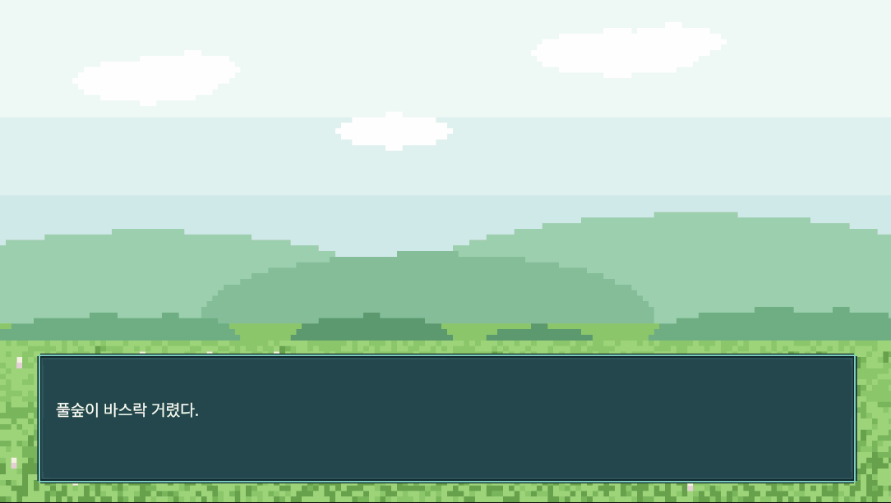

# TimelineVN

Unity Timeline 을 확장해서, Timeline 창 하나로 비주얼 노벨 한 장면을
만들 수 있게 하는 커스텀 트랙 시스템입니다.



---

## 왜 Timeline 으로 만들었나

시작은 무지에서 나왔습니다.

Timeline 을 실무에서 거의 써본 적이 없었고, VN 툴이 어떻게 생겼는지도 몰랐습니다.
Timeline 은 시간에 맞춰 알아서 진행되는 물건으로 보였고, VN 도 대사가 순서대로
흘러가니 비슷하지 않을까 생각했습니다.

실제로는 진행 단위가 달랐습니다. Timeline 은 시간이 흐르는 대로 쭉 나아가고,
VN 은 클릭이나 터치로 한 칸씩 나아갑니다. 대사에서 기다려야 하는데 시간은 계속
흐르니까요. 이 충돌을 푸는 것이 결국 이 프로젝트의 중심 작업이 됐습니다.

막힌 김에 기존 도구들도 찾아봤습니다. Ren'Py 는 파이썬에서 영감을 받은 자체 스크립트
언어로 대사와 분기를 적고, Unity 용인 Naninovel 도 텍스트 문서에 자체 스크립트를
적는 방식입니다. 대사가 많아질수록 이런 방식이 유리합니다. 검색이 되고,
버전 관리가 되고, 번역을 붙이기도 좋습니다.

그래도 Timeline 쪽에 자리가 있다고 봤습니다.

- 한 시간축 위에 여러 트랙이 쌓이므로, 표정과 대사와 카메라가 언제 겹치는지가
  그림으로 보입니다. 스크립트에서는 동시 실행을 별도 문법으로 적어야 합니다
- 만드는 방식이 코드 작성이 아니라 클립을 끌어다 놓고 인스펙터를 채우는 쪽입니다
- 별도의 VN 제작 환경을 들이지 않습니다. Unity 가 이미 갖고 있는 Timeline 위에
  트랙 하나를 얹는 것이라, Animation Track 이나 Audio Track 이 그대로 옆에 붙습니다.
  게임 안에 들어가는 VN 스타일 콘텐츠를 작업하기 좋습니다

그래서 이 프로젝트는 전용 VN 도구를 대체하려는 것이 아닙니다.
게임 전체가 VN 인 경우보다, 일반적인 Unity 게임의 대화 장면이나
스토리 이벤트 쪽에 맞습니다.

---

## 지금 되는 것

- Timeline 창에서 대사 트랙 추가, 클립 하나에 대사 한 줄
- 재생하면 클립 순서대로 대사창에 뜹니다
- 클립이 끝나면 멈추고, 스페이스나 클릭이나 터치로 다음 대사로 갑니다
- 연출 도중에 입력하면 기다리지 않고 그 대사의 정지 지점으로 건너뜁니다
- 재생 헤드를 끌면 그 시점 대사가 그대로 보입니다
- 클립마다 정지 여부를 끌 수 있습니다

예정 — 선택지와 분기, 표정 트랙, 타이핑 효과, 클립에 대사 내용 표시 등.

---

## 만드는 방식

코드를 쓰지 않고 Timeline 창에서 만듭니다.

```
DemoScenario (Timeline)
├─ Dialogue Track      -> DialogueUI 바인딩
│    [대사1][대사2][대사3][대사4][대사5]
└─ Animation Track     -> 캐릭터 Animator 바인딩
     [페이드인]
```

대사 하나가 클립 하나입니다. 클립을 끌어서 위치와 길이를 바꾸고,
클립을 선택해 인스펙터에 화자 이름과 대사를 적습니다.

클립 길이는 대사를 읽는 시간이 아닙니다. 그 대사가 떠 있는 동안 다른 트랙이
연출을 소화하는 시간이고, 클립 끝에서 멈춥니다. 읽는 속도는 플레이어 몫이라
멈춘 채로 무한정 기다립니다.

클립 사이를 붙이면 누르는 즉시 다음 대사로 가고, 벌리면 그만큼 뜸을 들입니다.
빈 대사 클립을 놓으면 그 구간은 대사창이 빕니다.
셋 다 Timeline 창에서 눈으로 보입니다.

---

## 쓰는 법

1. 씬에 `PlayableDirector` 를 만들고 `VisualNovelDirector` 를 같이 붙입니다
2. Timeline 창 우클릭 -> Dialogue Track
3. 트랙에 대사창(`DialogueUI`) 을 바인딩합니다
4. 클립을 올리고 인스펙터에 화자 이름과 대사를 적습니다
5. 재생합니다

`Assets/Scenes/DemoScene` 에 동작하는 예제가 있습니다.

---

## 구조

```
Assets/Scripts/
├─ Dialogue/
│   DialogueLine          대사 한 줄 데이터
│   DialogueUI            화면에 그린다
│   DialogueTrack         Timeline 트랙
│   DialogueClip          클립. 대사를 들고 있다
│   DialogueClipBehaviour 클립의 실행부. Apply 를 제공한다
│   DialogueTrackMixer    활성 클립을 골라 Apply 를 부른다
├─ Timeline/
│   ISingleClip           한 시점에 하나만 활성인 클립 인터페이스
└─ Playback/
    VisualNovelDirector   진입점. 시간축만 담당한다
    StopPointScanner      정지 지점 판정
    DirectorTimeControl   시간과 속도 조작
    IStopPointClip        정지를 요청할 수 있는 클립 인터페이스
```

---

## 환경

- Unity 6.3 LTS (6000.3.12f1), Universal 2D
- Timeline 1.8.11, Input System, TextMeshPro, UniTask

## 리소스

- 폰트: [Pretendard](https://github.com/orioncactus/pretendard) (SIL Open Font License 1.1)
- 이미지: AI 생성
